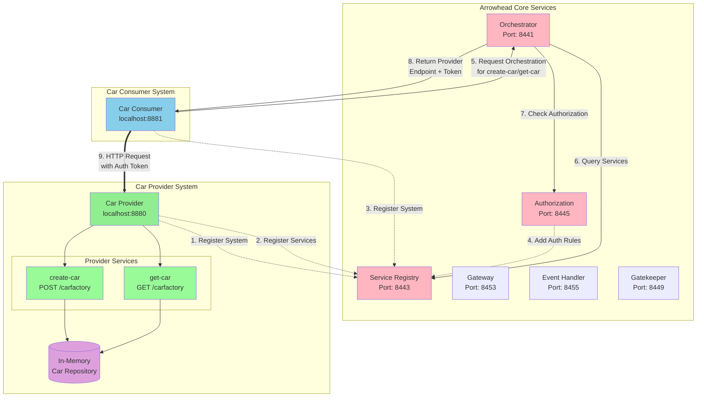
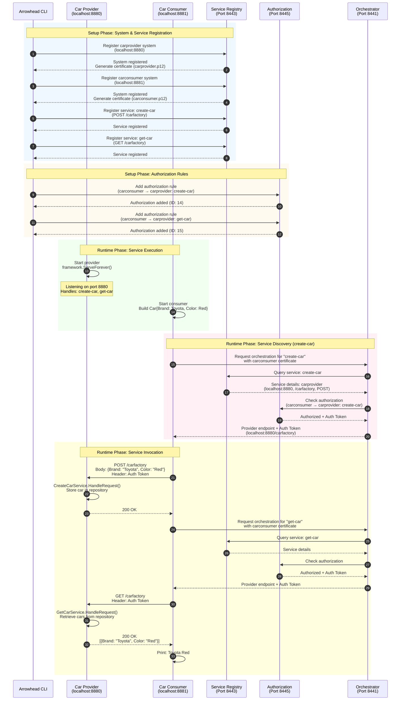

# Introduction
This repository provides an Arrowhead Golang SDK along with a CLI tool that simplifies the management of Arrowhead systems and facilitates the development of Arrowhead applications.

This document contains a short tutorial on how to develop and deploy car provider and consumer services, similar to the Java-based example in the guide:
[Arrowhead SOS Examples - Demo Car](https://github.com/arrowhead-f/sos-examples-spring/tree/master/demo-car).

It should be possible to **set up and run the car provider and consumer services** simply by executing the commands in a terminal.

---

# Installation

### 1. Install Golang
Download and install [Golang](https://go.dev/dl/).

### 2. Clone and Build the SDK
Clone this repository and build the **arrowhead** CLI tool:

```sh
git clone git@github.com:your-username/arrowhead-client-go.git
cd arrowhead-golang-sdk
make
sudo make install
```

### 3. Deploy Arrowhead core services
Follow the setup instructions in [https://github.com/eislab-cps/arrowhead-core-docker](https://github.com/eislab-cps/arrowhead-core-docker) repository.
Note: You must modify /etc/hosts as described in the instructions.

```console
git clone git@github.com:eislab-cps/arrowhead-core-docker.git
cd arrowhead-core-docker
docker-compose up
```

### 4. Configuration
All configurations are managed using environment variables.
Create a file called `arrowhead.env` and add the following content, replacing **XXXXX** with the actual path to your Arrowhead core services certificates:

```console
export ARROWHEAD_VERBOSE="true"
export ARROWHEAD_ASCII="true"

# Certificates configuration
export ARROWHEAD_KEYSTORE_PASSWORD="123456"
export ARROWHEAD_ROOT_KEYSTORE="/XXXXX/arrowhead-core-docker/c1/certificates/master.p12"
export ARROWHEAD_ROOT_KEYSTORE_ALIAS="arrowhead.eu"
export ARROWHEAD_CLOUD_KEYSTORE="/XXXXX/arrowhead-core-docker/c1/certificates/c1.p12"
export ARROWHEAD_CLOUD_KEYSTORE_ALIAS="c1.ltu.arrowhead.eu"
export ARROWHEAD_SYSOPS_KEYSTORE="/XXXXX/arrowhead-core-docker/c1/certificates/sysop.p12"
export ARROWHEAD_TRUSTSTORE="/XXXXX/arrowhead-core-docker/c1/certificates/truststore.pem"

# Arrowhead Core Services configuration
export ARROWHEAD_TLS="true"
export ARROWHEAD_AUTHORIZATION_HOST="localhost"
export ARROWHEAD_AUTHORIZATION_PORT="8445"
export ARROWHEAD_SERVICEREGISTRY_HOST="localhost"
export ARROWHEAD_SERVICEREGISTRY_PORT="8443"
export ARROWHEAD_ORCHESTRATOR_HOST="localhost"
export ARROWHEAD_ORCHESTRATOR_PORT="8441"
```

Remember to source the `arrowhead.env` file to load all configurations:
```console
source arrowhead.env
```

Try the Arrowhead CLI tool to see if it works:
```console
arrowhead systems ls
```

```console
╭─────┬─────────────────┬────────────────────┬──────╮
│ ID  │ SYSTEM NAME     │ ADDRESS            │ PORT │
├─────┼─────────────────┼────────────────────┼──────┤
│ 1   │ serviceregistry │ c1-serviceregistry │ 8443 │
│ 2   │ gateway         │ c1-gateway         │ 8453 │
│ 3   │ eventhandler    │ c1-eventhandler    │ 8455 │
│ 4   │ orchestrator    │ c1-orchestrator    │ 8441 │
│ 5   │ authorization   │ c1-authorization   │ 8445 │
│ 6   │ gatekeeper      │ c1-gatekeeper      │ 8449 │
╰─────┴─────────────────┴────────────────────┴──────╯
```

# Tutorial: Developing Car Provider and Consumer Services 
We are going to:

1. Register the `carprovider` system using the *arrowhead* CLI.
   - The CLI will automatically generate a PKCS#12 certificate.

2. Register the `carconsumer` system using the *arrowhead* CLI.

3. Register the `create-car` service to the `carprovider` and register the `get-car` service to the `carprovider`.

4. Add authorization rules allowing the `carconsumer` to access the `carprovider` services.

5. Implement the `carprovider` and `carconsumer` applications.

5. Start the `carprovider` and `carconsumer`.
   - The `carconsumer` will use the Arrowhead orchestration core service to find the endpoint of the `carprovider`.
   - It will then send an HTTP request to interact with it.

## Register a car provider
```console
mkdir carprovider;cd carprovider
```

```console
arrowhead systems register --name carprovider --address localhost --port 8880
```
```console
INFO[0000] Using openssl as certificate manager
Certificate request self-signature ok
subject=CN = carprovider.c1.ltu.arrowhead.eu
INFO[0000] System registered successfully, certificate stored in ./carprovider.p12 and ./carprovider.pub, config file stored in ./carprovider.env
```

The command will register a new system at the Arrowhead Service Registry core service, and generate a corresponding PKCS#12 certificate with CN *carprovider.c1.ltu.arrowhead.eu*.

```console
ls
```
```console
.rw------- 4.2k johan 15 Feb 09:04 -N  carprovider.p12
.rw-r--r--  451 johan 15 Feb 09:04 -N  carprovider.pub
```

Type the command below to list available systems:
```console
arrowhead systems ls
```
```console
╭─────┬─────────────────┬────────────────────┬──────╮
│ ID  │ SYSTEM NAME     │ ADDRESS            │ PORT │
├─────┼─────────────────┼────────────────────┼──────┤
│ 1   │ serviceregistry │ c1-serviceregistry │ 8443 │
│ 2   │ gateway         │ c1-gateway         │ 8453 │
│ 3   │ eventhandler    │ c1-eventhandler    │ 8455 │
│ 4   │ orchestrator    │ c1-orchestrator    │ 8441 │
│ 5   │ authorization   │ c1-authorization   │ 8445 │
│ 6   │ gatekeeper      │ c1-gatekeeper      │ 8449 │
│ 103 │ carprovider     │ localhost          │ 8880 │
╰─────┴─────────────────┴────────────────────┴──────╯
```

We can also filter to only list the car systems.
```console
arrowhead systems ls --filter car
```
```console
╭─────┬─────────────────┬───────────┬──────╮
│ ID  │ SYSTEM NAME     │ ADDRESS   │ PORT │
├─────┼─────────────────┼───────────┼──────┤
│ 103 │ carprovider     │ localhost │ 8880 │
╰─────┴─────────────────┴───────────┴──────╯
```

## Register a car consumer
```console
cd ..;mkdir carconsumer;cd carconsumer
```
```console
arrowhead systems register --name carconsumer --address localhost --port 8881
```
```console
INFO[0000] Using openssl as certificate manager
INFO[0000] System registered successfully, PKCS#12 certificate stored in ./carconsumer.p12 and ./carconsumer.pub, config file stored in ./carconsumer.env
```

```console
arrowhead systems ls --filter car
```
```console
╭─────┬─────────────────┬───────────┬──────╮
│ ID  │ SYSTEM NAME     │ ADDRESS   │ PORT │
├─────┼─────────────────┼───────────┼──────┤
│ 103 │ carprovider     │ localhost │ 8880 │
│ 104 │ carconsumer     │ localhost │ 8881 │
╰─────┴─────────────────┴───────────┴──────╯
```

## Register services
First let's register a function to create cars.
```console
arrowhead services register --system carprovider --definition create-car --uri /carfactory -m POST
```
```console
INFO[0000] Service registered                            HTTPMethod=POST ServiceDefinition=create-car ServiceURI=/carfactory SystemName=carprovider
```

Also, register a function to fetch cars.
```console
arrowhead services register --system carprovider --definition get-car --uri /carfactory -m GET
```
```console
INFO[0000] Service registered                            HTTPMethod=GET ServiceDefinition=get-car ServiceURI=/carfactory SystemName=carprovider
```

Lets list all registered services:
```console
arrowhead services ls --filter car
```
```console
╭────┬───────────────┬─────────────┬────────────────────┬───────────┬──────┬───────────────────╮
│ ID │ PROVIDER NAME │ URI         │ SERVICE DEFINITION │ ADDRESS   │ PORT │ METADATA          │
├────┼───────────────┼─────────────┼────────────────────┼───────────┼──────┼───────────────────┤
│ 84 │ carprovider   │ /carfactory │ create-car         │ localhost │ 8880 │ http-method: POST │
│ 85 │ carprovider   │ /carfactory │ get-car            │ localhost │ 8880 │ http-method: GET  │
╰────┴───────────────┴─────────────┴────────────────────┴───────────┴──────┴───────────────────╯
```

## Authorization
The next step is to add an anothorization rule allowing the *carconsumer* to acccess the *carprovider*.
```console
arrowhead auths add --consumer carconsumer --provider carprovider --service create-car
```
```console
NFO[0000] Authorization added                           AuthID=14
```

```console
arrowhead auths add --consumer carconsumer --provider carprovider --service get-car
```
```console
NFO[0000] Authorization added                           AuthID=15
```

The *carconsumer* can now access the *carprovider*. List list all authorization rules.

```console
arrowhead auths ls
```
```console
╭────┬──────────────────────┬──────────────────────┬────────────────────┬──────────────────╮
│ ID │ CONSUMER SYSTEM NAME │ PROVIDER SYSTEM NAME │ SERVICE DEFINITION │ INTERFACES       │
├────┼──────────────────────┼──────────────────────┼────────────────────┼──────────────────┤
│ 14 │ carconsumer          │ carprovider          │ create-car         │ HTTP-SECURE-JSON │
│ 15 │ carconsumer          │ carprovider          │ get-car            │ HTTP-SECURE-JSON │
╰────┴──────────────────────┴──────────────────────┴────────────────────┴──────────────────╯
```

## Optional: Orchestrations
Let's try to find the carprovider. Note that the we must use the certificate keystore (carconsumer.p12) of the carconsumer to run the command below.

```console
arrowhead orchestrate --system carconsumer --address localhost --port 8881 --keystore ./carconsumer.p12 --password 123456 --service create-car --compact
```
```console
╭────────────────────────────────────╮
│ ORCHESTRATION RESULT               │
├──────────────────────┬─────────────┤
│ FIELD                │ VALUE       │
├──────────────────────┼─────────────┤
│ Provider Address     │ localhost   │
│ Provider Port        │ 8880        │
│ Service URI          │ /carfactory │
│ Service Definition   │ create-car  │
│ Provider System Name │ carprovider │
╰──────────────────────┴─────────────╯
╭──────────────────────────────────────────────────────────────────────────╮
│ AUTHORIZATION TOKENS                                                     │
├──────────────────┬───────────────────────────────────────────────────────┤
│ FIELD            │ VALUE                                                 │
├──────────────────┼───────────────────────────────────────────────────────┤
│ HTTP-SECURE-JSON │ eyJhbGciOiJSU0EtT0FFUC0yNTYiLCJlbmMiOiJBMjU2Q0JDLU... │
╰──────────────────┴───────────────────────────────────────────────────────╯
╭──────────────────────────────────────╮
│ INTERFACE                            │
├────────────────┬─────────────────────┤
│ FIELD          │ VALUE               │
├────────────────┼─────────────────────┤
│ Updated At     │ 2023-06-08 12:01:21 │
│ ID             │ 1                   │
│ Interface Name │ HTTP-SECURE-JSON    │
│ Created At     │ 2023-06-08 12:01:21 │
╰────────────────┴─────────────────────╯
```

## Provider implementation
Create a file the provider directory called `provider.go`.
```go
package main

import (
	"encoding/json"
	"fmt"

	arrowhead "github.com/johankristianss/arrowhead/pkg/arrowhead"
	"github.com/johankristianss/arrowhead/pkg/rpc"
)

type Car struct {
	Brand string `json:"brand"`
	Color string `json:"color"`
}

type InMemoryCarRepository struct {
	cars []Car
}

type CreateCarService struct {
	inMemoryCarRepository *InMemoryCarRepository
}

func (s *CreateCarService) HandleRequest(params *arrowhead.Params) ([]byte, error) {
	fmt.Println("CreateCarService called, creating car")
	car := Car{}
	err := json.Unmarshal(params.Payload, &car)
	if err != nil {
		return nil, err
	}
	fmt.Println("Car: ", car)
	s.inMemoryCarRepository.cars = append(s.inMemoryCarRepository.cars, car)
	return nil, nil
}

type GetCarService struct {
	inMemoryCarRepository *InMemoryCarRepository
}

func (s *GetCarService) HandleRequest(params *arrowhead.Params) ([]byte, error) {
	carsJSON, err := json.Marshal(s.inMemoryCarRepository.cars)
	if err != nil {
		return nil, err
	}
	return carsJSON, nil
}

func checkError(err error) {
	if err != nil {
		fmt.Println(err)
	}
}

func main() {
	framework, err := arrowhead.CreateFramework()
	checkError(err)

	inMemoryCarRepository := &InMemoryCarRepository{}
	createCarService := &CreateCarService{inMemoryCarRepository: inMemoryCarRepository}
	getCarService := &GetCarService{inMemoryCarRepository: inMemoryCarRepository}

	framework.HandleService(createCarService, rpc.POST, "create-car", "/carfactory")
	framework.HandleService(getCarService, rpc.GET, "get-car", "/carfactory")

	err = framework.ServeForever()
	checkError(err)
}
```

## Consumer implementation
Paste this source code to a file called `consumer.go` in the consumer directory.
```go
package main

import (
	"encoding/json"
	"fmt"

	arrowhead "github.com/johankristianss/arrowhead/pkg/arrowhead"
)

type Car struct {
	Brand string `json:"brand"`
	Color string `json:"color"`
}

func checkError(err error) {
	if err != nil {
		fmt.Println(err)
	}
}

func main() {
	framework, err := arrowhead.CreateFramework()
	checkError(err)

	// Buiid the request
	params := arrowhead.EmptyParams()
	car := Car{Brand: "Toyota", Color: "Red"}
	carJSON, err := json.Marshal(car)
	checkError(err)
	params.Payload = carJSON

	// Send the request
	res, err := framework.SendRequest("create-car", params)
	checkError(err)

	// Fetch cars
	res, err = framework.SendRequest("get-car", arrowhead.EmptyParams())
	checkError(err)

	// Print the response
	cars := []Car{}
	err = json.Unmarshal(res, &cars)
	checkError(err)
	for _, car := range cars {
		fmt.Println(car.Brand, car.Color)
	}
}
```

## Run the demo
Open a new terminal window and type to start the *carprovider*:

```console
cd carprovider
source carprovider.env
go run provider.go
```

Open an another terminal and start the *carconsumer*:

```console
cd carconsumer
source carconsumer.env
go run consumer.go
```

🎉 Congratulations! You have successfully implemented and deployed Arrowhead-based car provider and consumer services in Golang! 🚀

---

# Car Demo Architecture

## System Architecture Diagram

This diagram shows the overall architecture of the car demo system, including all Arrowhead core services and the interaction between the car provider and consumer.



## Sequence Diagram

This diagram illustrates the complete sequence of interactions from system registration through service invocation.



### Key Components Explained

**Arrowhead Core Services:**
- **Service Registry**: Stores information about all registered systems and services
- **Orchestrator**: Helps consumers discover providers and returns service endpoints
- **Authorization**: Manages access control rules between systems

**Car Provider:**
- Implements two services: `create-car` (POST) and `get-car` (GET)
- Stores cars in an in-memory repository
- Listens on port 8880 at `/carfactory` endpoint

**Car Consumer:**
- Requests orchestration to discover the provider
- Creates a car using the `create-car` service
- Retrieves cars using the `get-car` service

**Security:**
- All systems use mutual TLS (mTLS) with PKCS#12 certificates
- Authorization tokens ensure only authorized systems can access services
